# Olist E-Commerce Business Performance Analysis

**Role:** End-to-End Operations Analytics | Retail / E-Commerce  
**Tools:** Python · SQL · Power BI · Excel · Git  
**Dataset:** [Olist Brazilian E-Commerce](https://www.kaggle.com/datasets/olistbr/brazilian-ecommerce) 100k+ orders, 2016 - 2018

---

## Business Problem

Olist, a Brazilian e-commerce marketplace, operates across multiple states and 
product categories. Leadership needs a clear view of which regions, categories, 
and customer segments drive profitable growth and where operational inefficiencies 
(late deliveries, high return rates, low review scores) are eroding margins.

This analysis delivers a full KPI framework, regional performance breakdown, 
customer lifetime value segmentation, and a 90-day revenue forecast packaged 
for both executive decision-making and analyst-level deep dives.

---

## Project Structure

```mermaid
graph TD
    root[olist-performance-analysis/]

    %% Main Branches
    root --> data[data/]
    root --> notebooks[notebooks/]
    root --> sql[sql/]
    root --> reports[reports/]
    root --> src[src/]
    root --> docs[docs/]
    root --> readme[README.md]

    %% Data Subfolders
    data --> raw[raw/ <br><i>Original CSVs - Git Ignored</i>]
    data --> cleaned[cleaned/ <br><i>Processed Data Outputs</i>]

    %% Notebooks Subfolders
    notebooks --> nb1[01_cleaning/ <br><i>Data Acquisition & Cleaning</i>]
    notebooks --> nb2[02_eda/ <br><i>Exploratory Data Analysis</i>]
    notebooks --> nb3[03_sql_validation/ <br><i>SQL Validation in Python</i>]
    notebooks --> nb4[04_forecasting/ <br><i>Time-Series Modeling</i>]

    %% SQL Subfolders
    sql --> schema[schema/ <br><i>Database & Table Scripts</i>]
    sql --> views[views/ <br><i>KPI View Definitions</i>]
    sql --> queries[queries/ <br><i>Analysis Queries</i>]

    %% Reports Subfolders
    reports --> dash[dashboard_exports/ <br><i>BI Screenshots & Exports</i>]
    reports --> deck[exec_deck/ <br><i>Executive PowerPoint</i>]
    reports --> memo[memo/ <br><i>Business Recommendations</i>]

    %% Styling
    style root fill:#2d3748,stroke:#1a202c,stroke-width:2px,color:#fff
    
```

## Setup Instructions

### 1. Clone the repository
\`\`\`bash
git clone https://github.com/Dunmxie/olist-performance-analysis.git
cd olist-performance-analysis
\`\`\`

### 2. Install dependencies
\`\`\`bash
pip install -r requirements.txt
\`\`\`

### 3. Download the dataset
\`\`\`bash
kaggle datasets download -d olistbr/brazilian-ecommerce
unzip brazilian-ecommerce.zip -d data/raw/
\`\`\`

---

## Key Deliverables

| Deliverable | Location | Audience |
|---|---|---|
| Cleaning + EDA Notebooks | `/notebooks/` | Technical reviewers |
| SQL KPI Views | `/sql/views/` | Technical reviewers |
| Executive Dashboard | `/reports/dashboard_exports/` | Business stakeholders |
| Analyst Deep-Dive | `/reports/dashboard_exports/` | Operations team |
| Exec Presentation Deck | `/reports/exec_deck/` | C-suite / clients |
| Recommendation Memo | `/reports/memo/` | All audiences |

---

## Status
🔄 In Progress: Data Cleaning